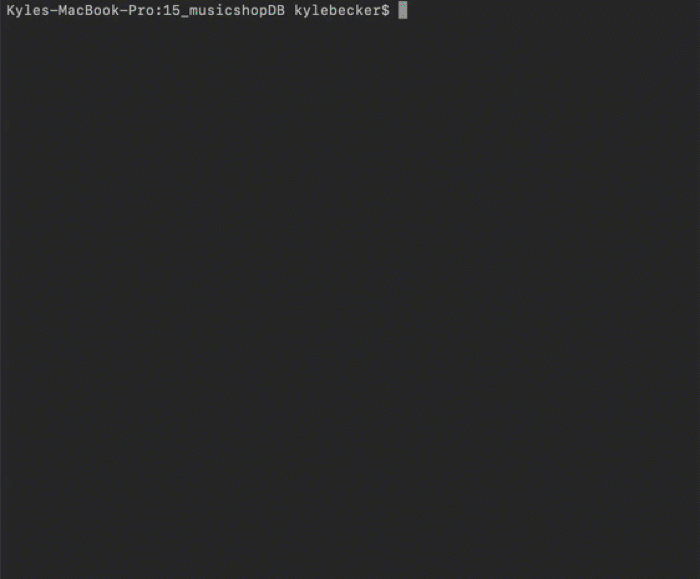
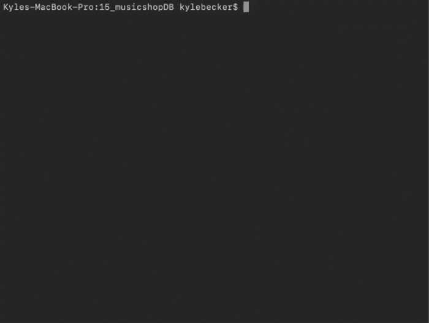
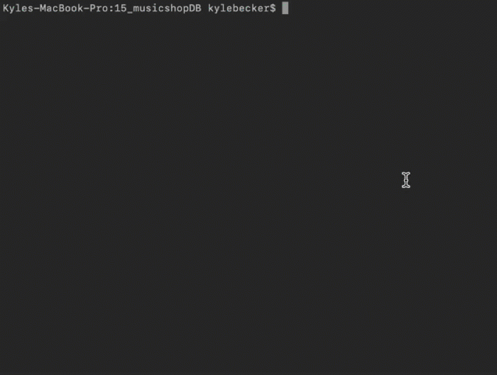

<h1>Music Shop</h1>

This is an app that runs in terminal simulating a musical shop online. Users can:

<ul>
  <li>Buy an instument</li>
  <li>Check inventory</li>
  <li>Restock the Inventory</li>
</ul>
 
 

<h1>Tech</h1>

<ul>This app uses</ul>
  <li>SQL Database</li>
  <li>Node.js</li>
  <li>MySQL Node Package</li>
 
 

<h1>How does it work for the user?</h1>

<h2>The user can buy one or more products</h2>

 
 

<h2>The user cannot buy more inventory than is in stock</h2>

 
 

<h1>How does it work for the shop owner?</h1>

<h2>The shop owner can check the stock</h2>

Check the stock with msINV.js

 
 

<h2>The shop owner can restock inventory</h2>

With msINV.js, we can restock the inventory if it gets too low.

 
 
